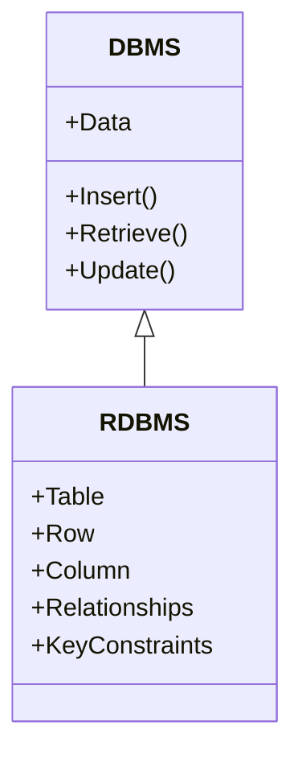
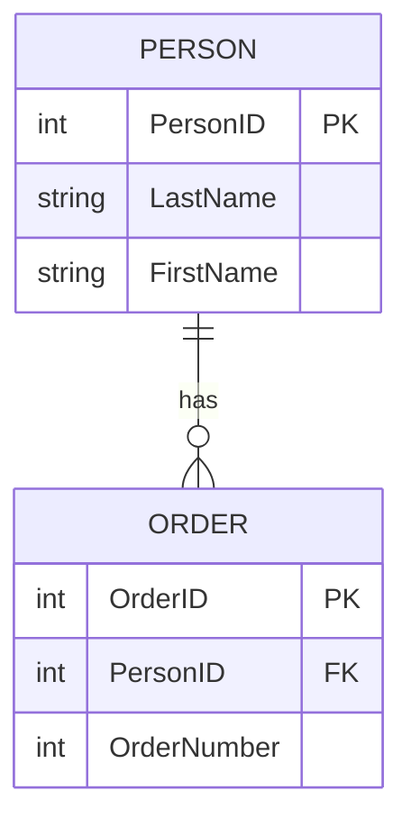
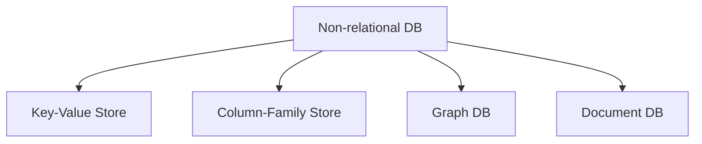

# Database Fundamentals

> **Goal:** Understand core concepts of databases, including types, structure, and key constraints, with practical examples and diagrams.

---

## Table of Contents

- [DBMS vs RDBMS](#difference-between-rdbms-and-dbms)
- [Relational vs Non-Relational Databases](#relational-database)
- [SQL Key Constraints](#sql-primary-key-constraint)
- [Common SQL Constraints](#constraints--rules-to-maintain-data-integrity)

---

## Difference Between RDBMS and DBMS

### DBMS

A **Database Management System (DBMS)** is software used to define, create, and maintain a database, providing controlled access to data.  
It manages the entire flow of data: insertion, retrieval, and ensures uniformity and efficiency in working with databases.

### RDBMS

A **Relational Database Management System (RDBMS)** is a type of DBMS that organizes data based on relationships and key constraints.  
It uses tables (schemas), rows (tuples), and enforces integrity and reduces redundancy through relationships.

### Diagram: DBMS vs RDBMS



---

## Relational Database

A **relational database** stores data in tables composed of rows and columns. Tables are linked using unique identifying keys.

- Designed for **structured data** (well-defined schema)
- SQL is the standard language for interacting with relational databases
- Common examples: MySQL, PostgreSQL, Microsoft SQL Server

### Diagram: Relational Database Structure



---

## Non-Relational Database

A **non-relational database** does not store data in tables; instead, it chooses the best structure for the data type.

- Designed for **unstructured or loosely defined data** (emails, videos, images, documents)
- Often called NoSQL databases (may or may not support SQL queries)
- Types:
  - **Key-value stores**
  - **Column-family stores**
  - **Graph databases**
  - **Document databases**

Examples: Apache Cassandra, MongoDB

### Diagram: Types of Non-Relational Databases




---

## Summary Table: Relational vs Non-Relational

| Feature           | Relational DB (RDBMS)   | Non-Relational DB (NoSQL)      |
|-------------------|------------------------|--------------------------------|
| Structure         | Tables (rows & columns)| Flexible (documents, graphs, etc.) |
| Data Type         | Structured             | Unstructured/Mixed             |
| Query Language    | SQL                    | Varies (NoSQL, some support SQL)|
| Examples          | MySQL, SQL Server      | MongoDB, Cassandra, Redis      |
| Relationships     | Foreign Keys           | Embedded, references, graph edges |


---

## SQL PRIMARY KEY Constraint

The **PRIMARY KEY** constraint uniquely identifies each record in a table.

- Must contain unique, non-null values
- Only one primary key per table (can be composite)

### Example

```sql
CREATE TABLE Persons (
    PersonID int NOT NULL,
    LastName varchar(255) NOT NULL,
    FirstName varchar(255),
    PRIMARY KEY (PersonID)
);
```

---

## FOREIGN KEY Constraint

A **FOREIGN KEY** is used to link two tables together. It refers to the primary key in another table.

### Example

A personId foreign key in orders table links each order to a person.

```sql
CREATE TABLE Orders (
    OrderID int NOT NULL,
    OrderNumber int NOT NULL,
    PersonID int,
    PRIMARY KEY (OrderID),
    FOREIGN KEY (PersonID) REFERENCES Persons(PersonID)   -- foreign key references a person
);
```

### Diagram: Foreign Key Relationship


---

## Constraints – Rules to Maintain Data Integrity

SQL constraints ensure the accuracy and reliability of data in the database.

- **NOT NULL**: Ensures a column cannot have a NULL value
- **UNIQUE**: Ensures all values in a column are different

```sql
CREATE TABLE Persons (
    ID int NOT NULL,
    LastName varchar(255) NOT NULL,
    FirstName varchar(255),
    Age int,
    CONSTRAINT UC_Person UNIQUE (ID,LastName)
);
```

- **PRIMARY KEY**: Uniquely identifies each row (combines NOT NULL + UNIQUE)
- **FOREIGN KEY**: Prevents actions that would destroy links between tables
    - E.g., prevents deleting a person who has orders
    - Validates insertion: referenced value must exist
- **CHECK**: Ensures values in a column satisfy a condition

```sql
CREATE TABLE Persons (
    ID int NOT NULL,
    LastName varchar(255) NOT NULL,
    FirstName varchar(255),
    Age int,
    CHECK (Age>=18)
);
```
Here, Age must be 18 or older.

- **DEFAULT**: Sets a default value for a column if no value is specified
---

> Use these fundamentals to choose and design databases that fit your application's needs.
