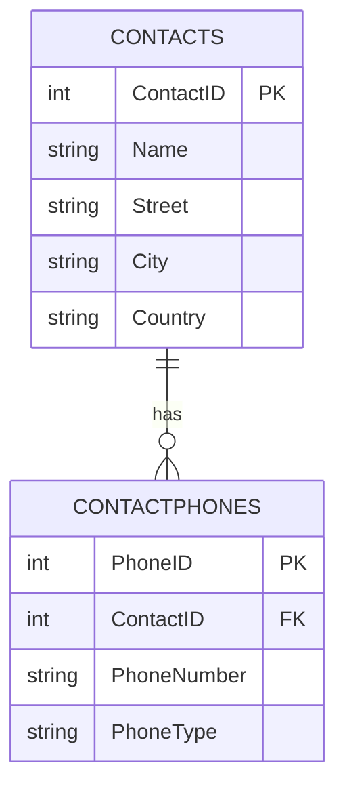
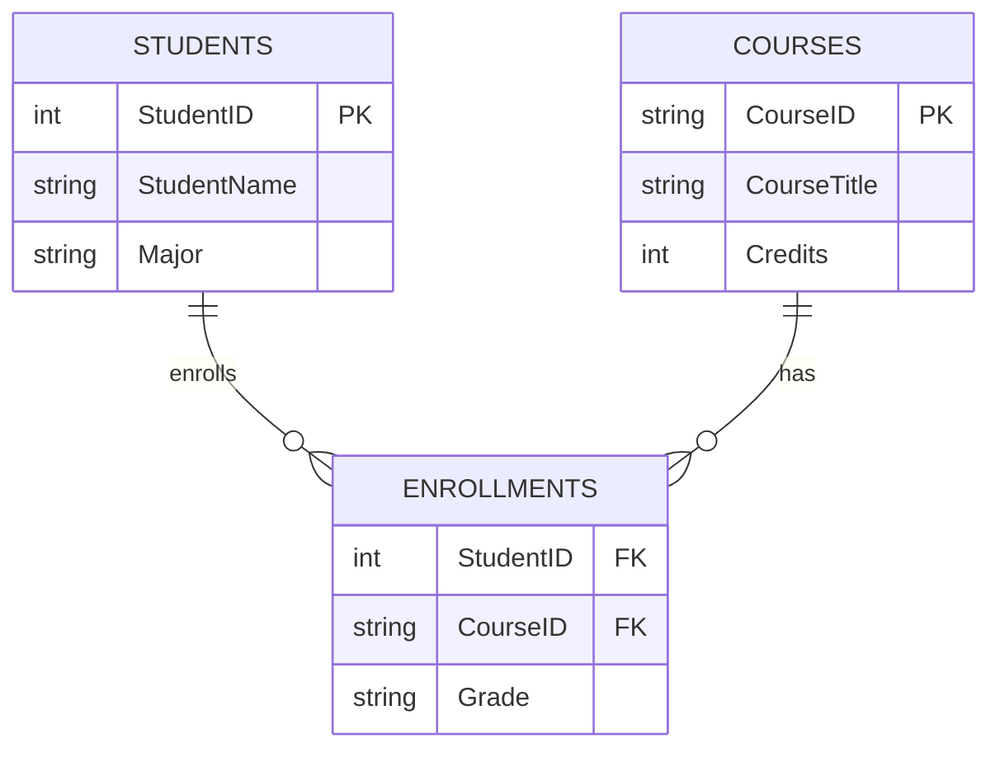
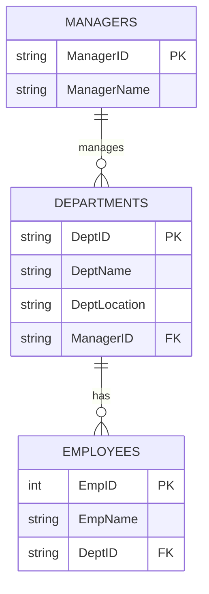

# Normalization

> **Goal:** Understand how normalization organizes relational data to eliminate redundancy and anomalies.

---

## Why Normalize?

- We want to build good relationships between tables, avoiding redundant data and excessive updates.
- Insert, delete, and update operations are tightly coupled—bad design means lots of repeated work.
- Normalizing our schema keeps things simple, scalable, and maintainable.

---

## Why Normalize? (With Diagram)


## What is Normalization?

Normalization is the process of decomposing big, complex tables into smaller tables with logical relations.  
We divide tables based on how attributes depend on keys and on each other.

---

## First Normal Form (1NF)

**1NF solves:**
- Composite attributes
- Multivalued attributes
- Nested relations

**Key idea:**  
Identify attributes causing redundancy (repeated values in rows), move them into separate tables, and reference them via primary keys.

### Example: Before 1NF

| ContactID | Name    | PhoneNumbers                | Street          | City  | Country |
| --------- | ------- | --------------------------- | --------------- | ----- | ------- |
| 1         | Ahmed   | `010-111, 012-222`          | 12 Nile St      | Cairo | Egypt   |
| 2         | Mariam  | `015-333`                   | 5 Tahrir Sq     | Cairo | Egypt   |
| 3         | Youssef | `010-444, 011-555, 012-666` | 89 Pyramids Ave | Giza  | Egypt   |

**Issue:**  
PhoneNumbers is storing multiple values in a single cell (not atomic) → violates 1NF.  
Adding Phone1, Phone2, Phone3 is a repeating group → also violates 1NF.

### After 1NF: Atomic Columns

Split the multi-valued attribute into a separate table:



**SQL Structure:**

```sql
CREATE TABLE Contacts (
  ContactID   INT PRIMARY KEY,
  Name        VARCHAR(100),
  Street      VARCHAR(200),
  City        VARCHAR(100),
  Country     VARCHAR(100)
);

CREATE TABLE ContactPhones (
  PhoneID     INT PRIMARY KEY,
  ContactID   INT NOT NULL,
  PhoneNumber VARCHAR(30) NOT NULL,
  PhoneType   VARCHAR(20), -- Mobile, Home, Work
  CONSTRAINT FK_ContactPhones_Contacts
    FOREIGN KEY (ContactID) REFERENCES Contacts(ContactID)
);
```

**Sample Data:**

```sql
INSERT INTO Contacts (ContactID, Name, Street, City, Country) VALUES
(1, 'Ahmed', '12 Nile St', 'Cairo', 'Egypt'),
(2, 'Mariam', '5 Tahrir Sq', 'Cairo', 'Egypt'),
(3, 'Youssef', '89 Pyramids Ave', 'Giza', 'Egypt');

INSERT INTO ContactPhones (PhoneID, ContactID, PhoneNumber, PhoneType) VALUES
(101, 1, '010-111', 'Mobile'),
(102, 1, '012-222', 'Home'),
(103, 2, '015-333', 'Mobile'),
(104, 3, '010-444', 'Mobile'),
(105, 3, '011-555', 'Work'),
(106, 3, '012-666', 'Home');
```

**Query: Get all phones for a contact**
```sql
SELECT c.Name, p.PhoneNumber, p.PhoneType
FROM Contacts c
JOIN ContactPhones p ON p.ContactID = c.ContactID
WHERE c.Name = 'Youssef';
```

**Result:**  
You avoided redundancy and repeating columns by isolating multivalued attributes.

---

## Second Normal Form (2NF)

**Requires:** Table is already in 1NF.

**2NF solves:**  
Partial dependency—attributes that depend on only part of a composite primary key.

**Key idea:**  
Every attribute should depend on the whole primary key, not just a part of it.  
If an attribute depends on only part of the key, move it into a separate table.

### Example: Partial Dependencies

| StudentID | CourseID | StudentName | Major | CourseTitle | Credits | Grade |
| --------- | -------- | ----------- | ----- | ----------- | ------- | ----- |
| 1001      | CS101    | Ahmed Ali   | CS    | Databases   | 3       | A-    |
| 1001      | CS102    | Ahmed Ali   | CS    | Networks    | 3       | B+    |
| 1002      | CS101    | Sara Hassan | IS    | Databases   | 3       | A     |

**Problems:**
- StudentName, Major depend only on StudentID.
- CourseTitle, Credits depend only on CourseID.
- Only Grade depends on both StudentID and CourseID.

**Update/Insert/Delete Anomalies:**  
- Changing “Databases” title requires updating many rows.
- Can't add a new course until a student enrolls.
- Deleting last enrollment in CS101 loses course info.

### After 2NF: Remove Partial Dependencies



**SQL Structure:**

```sql
CREATE TABLE Students (
  StudentID   INT PRIMARY KEY,
  StudentName VARCHAR(100) NOT NULL,
  Major       VARCHAR(50)  NOT NULL
);

CREATE TABLE Courses (
  CourseID    VARCHAR(20) PRIMARY KEY,
  CourseTitle VARCHAR(100) NOT NULL,
  Credits     INT NOT NULL CHECK (Credits > 0)
);

CREATE TABLE Enrollments (
  StudentID INT         NOT NULL,
  CourseID  VARCHAR(20) NOT NULL,
  Grade     VARCHAR(5),
  PRIMARY KEY (StudentID, CourseID),
  FOREIGN KEY (StudentID) REFERENCES Students(StudentID),
  FOREIGN KEY (CourseID)  REFERENCES Courses(CourseID)
);
```

**Query: Get all info**
```sql
SELECT s.StudentID, s.StudentName, s.Major,
       c.CourseID, c.CourseTitle, c.Credits,
       e.Grade
FROM Enrollments e
JOIN Students   s ON s.StudentID = e.StudentID
JOIN Courses    c ON c.CourseID  = e.CourseID;
```

**Result:**  
- Student data in Students table
- Course data in Courses table
- Enrollment (with grade) in Enrollments table

---

## Third Normal Form (3NF)

**Requires:** Table is already in 2NF.

**3NF solves:**  
Transitive dependency—non-key *(non primary key attribute)* attribute depends on another non-key attribute.

**Key idea:**  
Every non-key attribute should depend only on the key, not on other non-key attributes.

### Example: Transitive Dependency

| EmpID | EmpName | DeptID | DeptName    | DeptLocation | ManagerID | ManagerName |
| ----: | ------- | ------ | ----------- | ------------ | --------- | ----------- |
|     1 | Ahmed   | D10    | Accounting  | Cairo        | M1        | Mona        |
|     2 | Salma   | D10    | Accounting  | Cairo        | M1        | Mona        |
|     3 | Youssef | D20    | Engineering | Giza         | M2        | Kareem      |

**Functional dependencies:**
- EmpID → EmpName, DeptID
- DeptID → DeptName, DeptLocation, ManagerID
- ManagerID → ManagerName

**Anomalies:**
- Renaming “Accounting” requires updating many rows.
- Can't add department until an employee exists.
- Deleting last employee in D10 loses department/manager info.

**Transitive dependency:**  
DeptName, DeptLocation, ManagerID, ManagerName depend on DeptID and ManagerID, not on EmpID.

### After 3NF: Remove Transitive Dependencies



**SQL Structure:**

```sql
CREATE TABLE Managers (
  ManagerID   VARCHAR(10) PRIMARY KEY,
  ManagerName VARCHAR(100) NOT NULL
);

CREATE TABLE Departments (
  DeptID       VARCHAR(10) PRIMARY KEY,
  DeptName     VARCHAR(100) NOT NULL,
  DeptLocation VARCHAR(100) NOT NULL,
  ManagerID    VARCHAR(10)  NOT NULL,
  FOREIGN KEY (ManagerID) REFERENCES Managers(ManagerID)
);

CREATE TABLE Employees (
  EmpID   INT PRIMARY KEY,
  EmpName VARCHAR(100) NOT NULL,
  DeptID  VARCHAR(10)  NOT NULL,
  FOREIGN KEY (DeptID) REFERENCES Departments(DeptID)
);
```

**Query: View all employee/department/manager info**
```sql
SELECT e.EmpID, e.EmpName,
       d.DeptID, d.DeptName, d.DeptLocation,
       m.ManagerID, m.ManagerName
FROM Employees e
JOIN Departments d ON d.DeptID = e.DeptID
JOIN Managers    m ON m.ManagerID = d.ManagerID;
```

---

> **Summary:**  
Normalization is all about organizing data to reduce redundancy, avoid anomalies, and keep your database scalable and reliable. Each normal form builds on the previous, isolating dependencies at every step.
