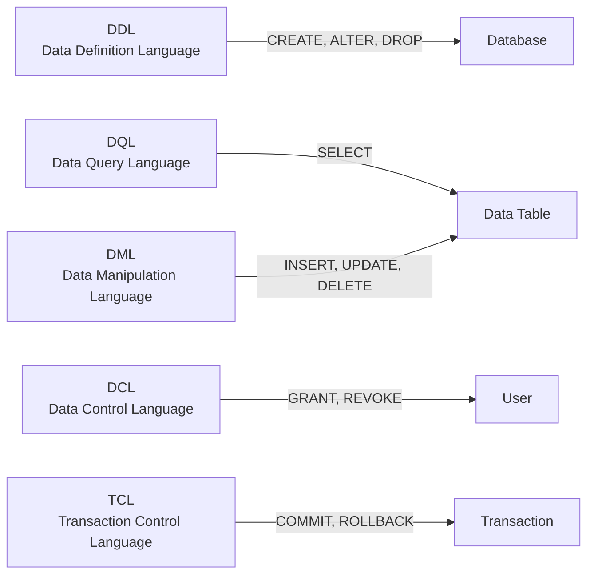
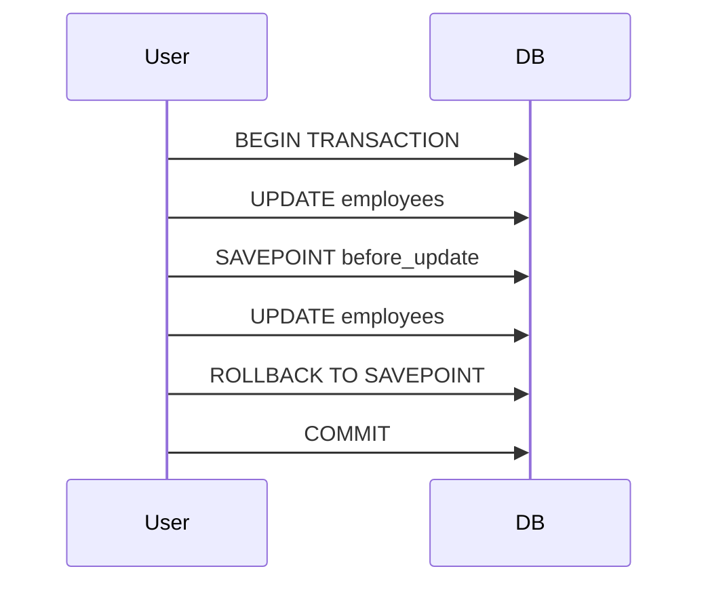

# SQL Essentials

> **Goal:** Learn the fundamental SQL command categories and how to use JOINs to combine data from multiple tables.

---

SQL Commands are mainly categorized into five categories: 

- **DDL** – Data Definition Language
- **DQL** – Data Query Language
- **DML** – Data Manipulation Language
- **DCL** – Data Control Language
- **TCL** - Transaction Control Language


---

## SQL Commands Overview



---

## 1. DDL - Data Definition Language

Altering, creating, and deleting database structure, like tables and indexes.

- **Commands:** `CREATE`, `ALTER`, `DROP`, `TRUNCATE`

---

## 2. DQL - Data Query Language

DQL statements are used for performing queries on the data within schema objects.

- When a SELECT is fired against a table or tables, the result is compiled into a further temporary table, which is displayed or perhaps received by the program.

- **Commands:** `SELECT`, `WHERE`, `FROM`, `ORDER BY`, `LIMIT`


---

## 3. DML - Data Manipulation Language

Handles communication with data already existing in our DB tables.  
Controls access to the data that exists in DB.

- **Commands:** `INSERT`, `UPDATE`, `DELETE`


---

## 4. DCL - Data Control Language

Deals with rights and permissions and other controls.

- **Commands:** `GRANT`, `REVOKE`
  - **grant:** Assign permission to a user specifying the operations the user has access to.
  - **revoke:** Remove the assigned access or privilege from this user and throw away its roles.

**Example:**
```sql
GRANT SELECT, UPDATE ON employees TO Reyad;
```
This command grants Reyad permission to select and update records in the employee table only.


---

## 5. TCL - Transaction Control Language

**Transaction:**  
A set of tasks that are done together and grouped in a single execution unit. If one task of these tasks fails the full transaction will fail ("all or no one").

- **Commands:** `BEGIN TRANSACTION`, `COMMIT`, `ROLLBACK`, `SAVEPOINT`

**Example:**
```sql
BEGIN TRANSACTION;
UPDATE employees SET department = 'Marketing' WHERE department = 'Sales';
SAVEPOINT before_update;
UPDATE employees SET department = 'IT' WHERE department = 'HR';
ROLLBACK TO SAVEPOINT before_update;
COMMIT;
```
In this example, we save a state with a savePoint so the transaction can roll back and back to the savepoint before being committed.



---

## Joins 

SQL joins are fundamental tools for combining data from multiple tables in relational databases.

---

### Types of SQL Joins 

#### 1. Inner Join

(The condition is satisfied) is the main rule.


Selects and combines all rows from tables where the condition is satisfied.

**Example:**
```sql 
SELECT StudentCourse.COURSE_ID, Student.NAME, Student.AGE FROM Student
INNER JOIN StudentCourse
ON Student.ROLL_NO = StudentCourse.ROLL_NO;
```

---

#### 2. SQL LEFT JOIN

Returns all rows from left table with matching rows. If no matching rows, then rows will be retrieved with null values for columns of right table.


**Example:**
```sql
SELECT Student.NAME,StudentCourse.COURSE_ID 
FROM Student
LEFT JOIN StudentCourse 
ON StudentCourse.ROLL_NO = Student.ROLL_NO;
```


---

#### 3. SQL RIGHT JOIN

It is like left join, returns all matching rows from two tables, and also returns all the right side table data even if there is no matching with it in left table.


**Example:**
```sql
SELECT Student.NAME,StudentCourse.COURSE_ID 
FROM Student
RIGHT JOIN StudentCourse 
ON StudentCourse.ROLL_NO = Student.ROLL_NO;
```
Here the full right table will be retrieved with rows that have null values if there is no matching.

---

#### 4. SQL FULL JOIN

The result will contain all the rows from both tables with null values for no matching rows (combines the result of left join and right join).


**Example:**
```sql
SELECT Student.NAME,StudentCourse.COURSE_ID 
FROM Student
FULL JOIN StudentCourse 
ON StudentCourse.ROLL_NO = Student.ROLL_NO;
```

---

#### 5. Natural Join

A Natural Join is a type of INNER JOIN that automatically joins two tables based on columns with the same name and data type.
It returns only the rows where the values in the common columns match.

**Example:**
```sql
SELECT student_id, name, dept_name
FROM Students
NATURAL JOIN Departments;
```
NATURAL JOIN automatically detects that both tables have a column called dept_id and joins them on Students.dept_id = Departments.dept_id.

---

#### 6. Cross Join

SQL CROSS JOIN generates all possible combinations of rows from two or more tables.

A use case:  
Simulation or Probability Scenarios  
Example: Rolling two dice.  
Dice1 (values 1–6)  
Dice2 (values 1–6)  
CROSS JOIN → All 36 outcomes → can calculate probabilities.

So it is used whenever we want all possible combinations of two data sets.

**Example:**
```sql
SELECT *
FROM CUSTOMER
CROSS JOIN ORDERS;
```


---
