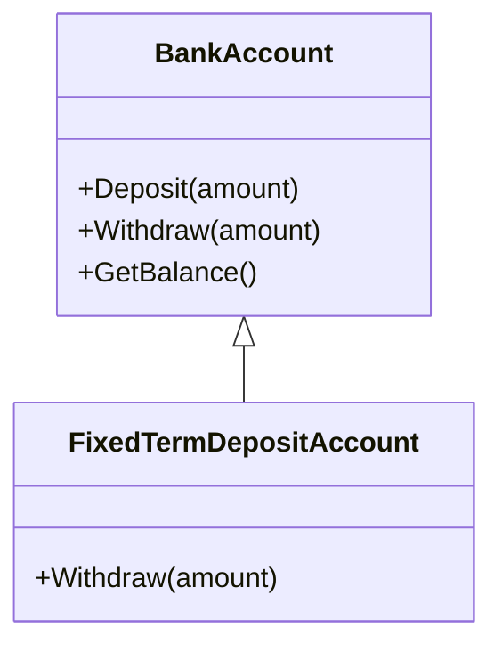
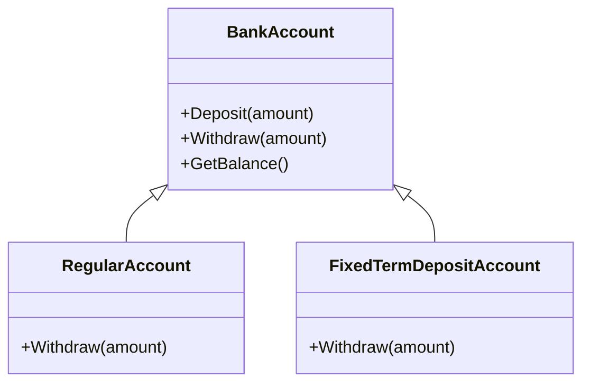

# Liskov Substitution Principle (LSP)

We can say that when we have Parent-Child relationships, i.e., Inheritance Relationships between two classes, then if we successfully replace the object/instance of a parent class with an object/instance of the child class without affecting the behavior of the base class instance, it is said to be in Liskov Substitution Principle.

---

## Violating LSP

### Class Diagram: Before LSP (Violation)



```csharp
public class BankAccount
{
    protected double balance;
    public virtual void Deposit(double amount)
    {
        balance += amount;
    }
    public virtual void Withdraw(double amount)
    {
        if (balance >= amount)
        {
            balance -= amount;
        }
        else
        {
            throw new InvalidOperationException("Insufficient funds");
        }
    }
    public double GetBalance()
    {
        return balance;
    }
}
public class FixedTermDepositAccount : BankAccount
{
    public override void Withdraw(double amount)
    {
        throw new InvalidOperationException("Cannot withdraw from a fixed term deposit account until term ends");
    }
}
```

Now here if you noticed, if we replaced a FixedTermDepositAccount object with a BankAccount object in a context that expects withdrawals to be possible, the program will break, violating the Liskov Substitution Principle.

---

## Solution: Following LSP

First, we depend on abstracts or interfaces and try to abstract all shared methods. Each subclass should behave in a way that will not surprise code that expects the base class.

### Class Diagram: After LSP (Solution)



```csharp
public abstract class BankAccount
{
    protected double balance;
    public virtual void Deposit(double amount)
    {
        balance += amount;
        Console.WriteLine($"Deposit: {amount}, Total Amount: {balance}");
    }
    public abstract void Withdraw(double amount);
    public double GetBalance()
    {
        return balance;
    }
}
public class RegularAccount : BankAccount
{
    public override void Withdraw(double amount)
    {
        if (balance >= amount)
        {
            balance -= amount;
            Console.WriteLine($"Withdraw: {amount}, Balance: {balance}");
        }
        else
        {
            Console.WriteLine($"Trying to Withdraw: {amount}, Insufficient Funds, Available Funds: {balance}");
        }
    }
}
public class FixedTermDepositAccount : BankAccount
{
    private bool termEnded = false; // simplification for the example
    public override void Withdraw(double amount)
    {
        if (!termEnded)
        {
            Console.WriteLine("Cannot withdraw from a fixed term deposit account until term ends");
        }
        else if (balance >= amount)
        {
            balance -= amount;
            Console.WriteLine($"Withdraw: {amount}, Balance: {balance}");
        }
        else
        {
            Console.WriteLine($"Trying to Withdraw: {amount}, Insufficient Funds, Available Funds: {balance}");
        }
    }
}

//Testing the Liskov Substitution Principle
public class Program
{
    public static void Main()
    {
        Console.WriteLine("RegularAccount:");
        var RegularBankAccount = new RegularAccount();
        RegularBankAccount.Deposit(1000);
        RegularBankAccount.Deposit(500);
        RegularBankAccount.Withdraw(900);
        RegularBankAccount.Withdraw(800);
        Console.WriteLine("\nFixedTermDepositAccount:");
        var FixedTermDepositBankAccount = new FixedTermDepositAccount();
        FixedTermDepositBankAccount.Deposit(1000);
        FixedTermDepositBankAccount.Withdraw(500);
        
        Console.ReadKey();
    }
}
```

So if you noticed here, we did a bank account as our main or super class, which is inherited and has its common methods overridden. The subclasses each implement the functions as needed, ensuring that substituting a child for a parent does not break the expectations of the code using the parent.

---
