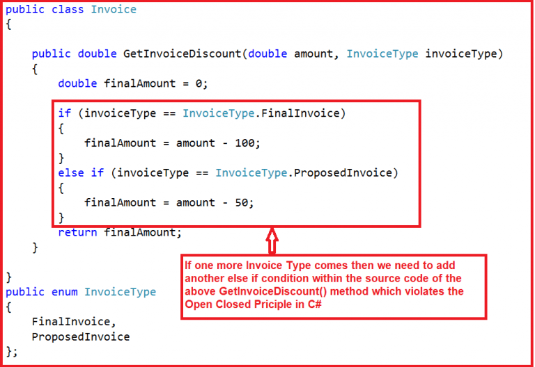

# Open/Closed Principle (OCP)


## Definition
The **Open/Closed Principle** states:
> Software entities (classes, modules, functions) should be **open for extension**, but **closed for modification**.

when a requirement change or any new requirement comes at any given time, instead of touching the existing functionality,
it’s always better and suggested to create new derived classes and leave the original class implementation as it is

This makes our system **more maintainable**, **less error-prone**, and **easier to extend**.

We should go for EXTENSION instead of MODIFICATION as per the Open-Closed principle.


Example to Understand Open-Closed Principle in C#.



Tomorrow, if one more Invoice Type comes into the picture, we need to modify the GetInvoiceDiscount() method logic by adding another if block to the source code.
Changing the source code for the new requirement violates the Open-Closed Principle in C#. 


```csharp
    public class Invoice
    {        
        public double GetInvoiceDiscount(double amount, InvoiceType invoiceType)
        {
            double finalAmount = 0;
            if (invoiceType == InvoiceType.FinalInvoice)
            {
                finalAmount = amount - 100;
            }
            else if (invoiceType == InvoiceType.ProposedInvoice)
            {
                finalAmount = amount - 50;
            }
            return finalAmount;
        }
    }
    public enum InvoiceType
    {
        FinalInvoice,
        ProposedInvoice
    };


```
The problem with the above example is that if we want to add another new invoice type, we need to add one more “else if” condition in the same “GetInvoiceDiscount” method.
In other words, we need to modify the Invoice class GetInvoiceDiscount Method. Suppose we are changing the Invoice class GetInvoiceDiscount Method again and again.
In that case, we need to ensure that the previous and new functionalities are working properly by testing the existing functionalities again.
This is because we need to ensure that the existing clients referencing this class are working properly as expected.

here is the code after applying OCP 


```csharp
namespace SOLID_PRINCIPLES.OCP
{
    public class Invoice
    {
        public virtual double GetInvoiceDiscount(double amount)
        {
            return amount - 10;
        }
    }
    
    public class FinalInvoice : Invoice
    {
        public override double GetInvoiceDiscount(double amount)
        {
            return base.GetInvoiceDiscount(amount) - 50;
        }
    }
    public class ProposedInvoice : Invoice
    {
        public override double GetInvoiceDiscount(double amount)
        {
            return base.GetInvoiceDiscount(amount) - 40;
        }
    }
    public class RecurringInvoice : Invoice
    {
        public override double GetInvoiceDiscount(double amount)
        {
            return base.GetInvoiceDiscount(amount) - 30;
        }
    }
}

```


now we are followin OCP 
Tomorrow, if another Invoice Type needs to be added, we need to create a new class by inheriting it from the Invoice class, and if needed, then we need to override the GetInvoiceDiscount() method.
The point that you need to keep focus on is we are not changing the code of the Invoice class. Now, the Invoice class is Closed for Modification.
But it is Open for Extension as it allows the creation of new classes deriving from the base Invoice class, which follows the Open-Closed Principle in C#. 


here is another complex 

the code bdfore OCP 


```csharp
    public enum CustomerType
    {
        Regular,
        Premium,
        Newbie
    }


    public class DiscountCalculator
    {
        public double CalculateDiscount(double price, CustomerType customerType)
        {
            switch (customerType)
            {
                case CustomerType.Regular:
                    return price * 0.1;  // 10% discount for regular customers
                case CustomerType.Premium:
                    return price * 0.3;  // 30% discount for premium customers
                case CustomerType.Newbie:
                    return price * 0.05; // 5% discount for new customers
                default:
                    throw new ArgumentOutOfRangeException();
            }
        }
    }

```
here we noticed a vilation as mentioned above ,for adding any new type we should **modify the main class** and add an if condition for each one and this is a violation 

**so here is the solution  : ** 


```csharp

    //Create an interface for the discount strategy
    public interface IDiscountStrategy
    {
        double CalculateDiscount(double price);
    }

    //Implement this interface for each discount type
    public class RegularDiscount : IDiscountStrategy
    {
        public double CalculateDiscount(double price)
        {
            return price * 0.1;
        }
    }

    public class PremiumDiscount : IDiscountStrategy
    {
        public double CalculateDiscount(double price)
        {
            return price * 0.3;
        }
    }

    public class NewbieDiscount : IDiscountStrategy
    {
        public double CalculateDiscount(double price)
        {
            return price * 0.05;
        }
    }

    //Modify the DiscountCalculator class to accept an IDiscountStrategy
    public class DiscountCalculator
    {
        private readonly IDiscountStrategy _discountStrategy;

        public DiscountCalculator(IDiscountStrategy discountStrategy)
        {
            _discountStrategy = discountStrategy;
        }

        public double CalculateDiscount(double price)
        {
            return _discountStrategy.CalculateDiscount(price);
        }
    }
    
    //Testing the Open-Closed Principle
    public class Program
    {
        public static void Main()
        {
            var regularDiscount = new RegularDiscount();
            var calculator = new DiscountCalculator(regularDiscount);
            double discountedPrice = calculator.CalculateDiscount(100); // 10% discount applied

            var premiumDiscount = new PremiumDiscount();
            calculator = new DiscountCalculator(premiumDiscount);
            discountedPrice = calculator.CalculateDiscount(100); // 30% discount applied
            
            Console.ReadKey();
        }
    }

```

**now in the solution here we solved all issues**
if you want to add any other types you can create new class and inherit from you super class without any modifications in your old code 
