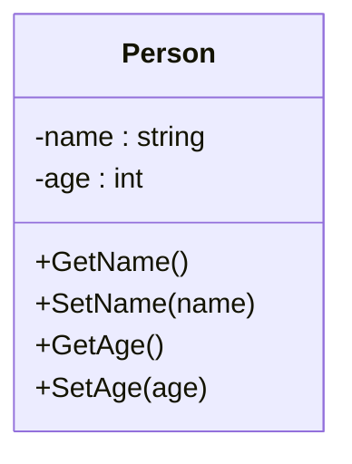
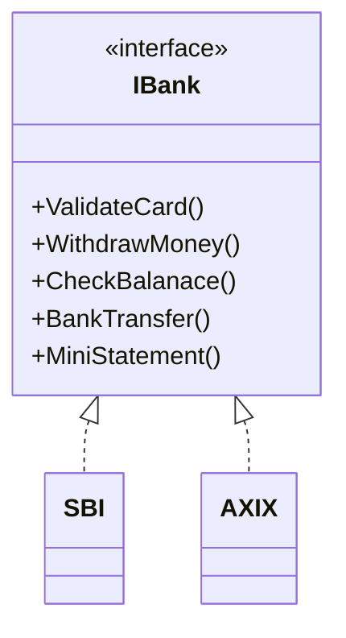
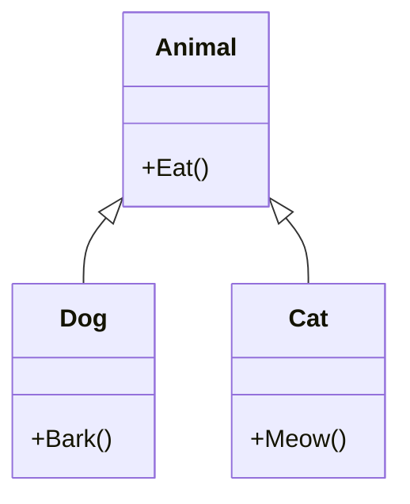
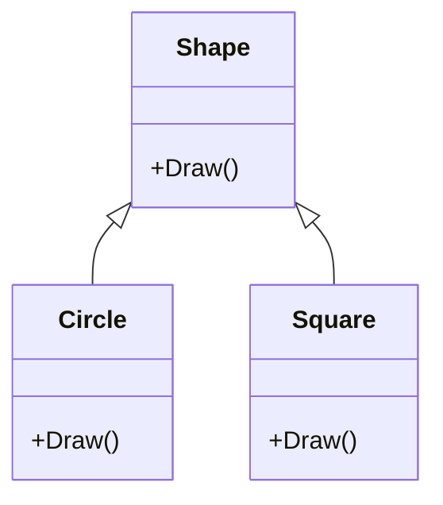

# OOP Fundamentals (The Big Four)

> **Goal:** Understand the four pillars of Object-Oriented Programming (OOP) and how they enable robust, reusable, and maintainable software.

---

## Table of Contents

- [Encapsulation](#encapsulation)
- [Abstraction](#abstraction)
- [Inheritance](#inheritance)
- [Polymorphism](#polymorphism-in-c)

---

## Encapsulation

Encapsulation hides the internal state and functionality of an object, allowing access only through a public set of functions.  
It is a mechanism to achieve data hiding.

### What is Data Hiding in C#?

Data hiding (Information Hiding) is the process of protecting internal data from misuse by the outside world.  
**Encapsulation** enables data hiding by restricting direct access to object fields, exposing only validated access via methods and properties.

#### Why use Encapsulation?

- Data protection
- Achieving Data Hiding
- Security

### Diagram: Encapsulation



---

## Abstraction

Abstraction is representing essential features without including background details.  
It means defining object operations (methods) while hiding their implementation details.

### Real-world Example

When logging into a website (Facebook, Twitter, LinkedIn), you enter your credentials and get access.  
You don’t see how data is processed or what algorithms are used—this logic is **abstracted** away.

### Problem Example: Violation of Abstraction

When users access classes directly, they can see implementation details, which can cause security issues.  
We should avoid exposing implementation details.

#### Example

```csharp
public class SBI { /* ...methods... */ }
public class AXIX { /* ...methods... */ }

// Usage
SBI sbi = new SBI();
AXIX axix = new AXIX();
```

### Solution: Applying Abstraction

We can use interfaces or abstract classes to hide implementation details.

#### Example using Interface

```csharp
public interface IBank
{
    void ValidateCard();
    void WithdrawMoney();
    void CheckBalanace();
    void BankTransfer();
    void MiniStatement();
}

public class SBI : IBank { /* ...implementations... */ }
public class AXIX : IBank { /* ...implementations... */ }

public class BankFactory
{
    public static IBank GetBankObject(string bankType)
    {
        return bankType == "SBI" ? new SBI() : new AXIX();
    }
}

// Usage
IBank sbi = BankFactory.GetBankObject("SBI");
IBank axix = BankFactory.GetBankObject("AXIX");
```

Now, users only interact with the `IBank` interface, not the concrete classes.

#### Encapsulation vs Abstraction

| Principle      | Focus               | Achieved By                           |
|----------------|---------------------|---------------------------------------|
| Encapsulation  | Data hiding         | Private fields, public methods        |
| Abstraction    | Implementation hiding| Interfaces, abstract classes          |

### Diagram: Abstraction



---

## Inheritance

Inheritance allows a class to acquire members (fields, methods) of another class by establishing a parent/child relationship.

#### Benefits

- Reusability: Avoids code duplication by reusing parent class logic in child classes.
- Hierarchical organization of classes.

#### Types of Inheritance in C#

- **Single**: One parent, one child.
- **Multilevel**: Child becomes a parent for another child.
- **Hierarchical**: Multiple children share the same parent.
- **Multiple**: Only via interfaces.

#### Key Concepts

- **Access Modifiers**:
    - `public`: Accessible everywhere.
    - `protected`: Accessible in the same class and derived classes.
    - `private`: Not inherited (only in the same class).
- **Constructors**:
    - Parent constructors are called implicitly before child constructors.
    - Use `base()` to call a specific parent constructor.
- **Method Overriding**:
    - Use `virtual` in parent and `override` in child to change behavior.
    - Use `sealed` to prevent further overriding.
- **Upcasting & Downcasting**:
    - Upcasting: Child reference stored in parent variable (can only access parent members).
    - Downcasting: Parent reference cast back to child (can access child-specific members).
- **Keywords**:
    - `is`: Checks type compatibility.
    - `as`: Safe casting, returns null if the cast fails.
    - `new`: Hides a parent method instead of overriding it.
- **Polymorphism**:
    - Achieved through method overriding (runtime polymorphism).

### Diagram: Inheritance



---

## Polymorphism in C#

Polymorphism is one of the four pillars of OOP and means "many forms".  
It allows the same method, operator, or object to behave differently depending on context.

### Why Polymorphism is Useful

- Increases flexibility and reusability of code
- Supports extensibility—new classes can be added without changing existing code
- Reduces code duplication

### Types of Polymorphism in C#

1. **Compile-Time Polymorphism** (Static / Early Binding)  
   Method call is bound to the method body at compile time.  
   Achieved through:
   - Method Overloading
   - Operator Overloading

2. **Run-Time Polymorphism** (Dynamic / Late Binding)  
   Method call is resolved at runtime by the CLR.  
   Achieved through:
   - Method Overriding (`virtual` / `override`)
   - Method Hiding (`new` keyword—not true overriding)

---

### Compile-Time Polymorphism Example — Method Overloading

```csharp
class Program
{
    public void Add(int a, int b) { Console.WriteLine(a + b); }
    public void Add(float x, float y) { Console.WriteLine(x + y); }
    public void Add(string s1, string s2) { Console.WriteLine(s1 + " " + s2); }

    static void Main()
    {
        Program obj = new Program();
        obj.Add(10, 20);              // Calls int version
        obj.Add(10.5f, 20.5f);        // Calls float version
        obj.Add("Pranaya", "Rout");   // Calls string version
    }
}
```

---

### Run-Time Polymorphism Example — Method Overriding

```csharp
class Class1
{
    public virtual void Show()
    {
        Console.WriteLine("Parent Class Show Method");
    }
}

class Class2 : Class1
{
    public override void Show()
    {
        Console.WriteLine("Child Class Show Method");
    }
}

class Program
{
    static void Main()
    {
        Class1 obj1 = new Class2(); // Upcasting
        obj1.Show(); // Decided at runtime — Child's method is called
    }
}
```

**Explanation**  
- Upcasting (`Class1 obj1 = new Class2();`) allows calling overridden methods.
- The decision on which method to call is made at runtime.
- Requires `virtual` in base class, `override` in derived class.

#### Key Points to Remember
- **Overloading**: Same name, different signature → Compile time.
- **Overriding**: Same name, same signature, different implementation → Runtime.
- **Hiding**: Same name, hides base method, not true overriding.
- Always use `virtual` and `override` for runtime polymorphism.
- Upcasting enables polymorphic behavior.

### Diagram: Polymorphism



---

## Summary Table

| Principle     | Purpose                 | Achieved By                         |
|---------------|-------------------------|-------------------------------------|
| Encapsulation | Data hiding             | Private fields, public methods      |
| Abstraction   | Implementation hiding   | Interfaces, abstract classes        |
| Inheritance   | Code reuse, hierarchy   | Parent-child relationship           |
| Polymorphism  | Many forms, flexibility | Overloading, overriding             |

---

> Use these four pillars to design software that's modular, reusable, and easy to maintain.
