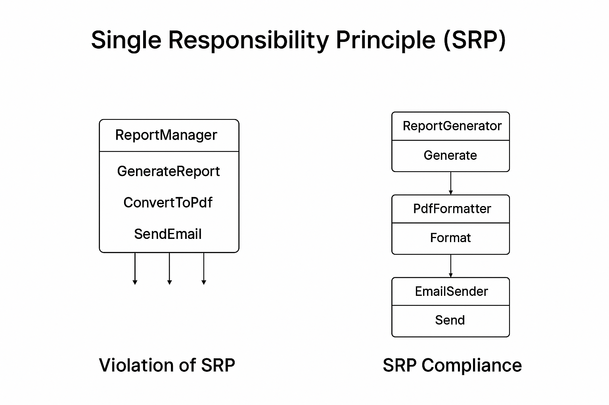

# Single Responsibility Principle (SRP)

> **Do one thing and do it well.**

As Uncle Bob put it:  
*"There should never be more than one reason for a class to change."*  
A class should have **one and only one job**.

When a class takes on multiple responsibilities, those concerns get tangled together. This makes the code harder to maintain, test, and extend — because changing one part risks breaking something unrelated.

---
## here is an example to get the point 
first we have  a `ReportManager` class that:

1. Generates a financial report.
2. Formats it into PDF.
3. Sends it over email to the client.  

```csharp
public class ReportManager
{
    public string GenerateReport()
    {
        // Logic to fetch data and build report
        return "Report data";
    }

    public byte[] ConvertToPdf(string reportData)
    {
        // Convert the string to PDF bytes
        return new byte[0];
    }

    public void SendEmail(byte[] pdfReport, string recipient)
    {
        // Connect to SMTP server and send email
    }
}
```


as you know there are multiple tasks and funcitons that has been done with this class and this violates our SRP 

Our current class contains multiple responsibilities:
- `GenerateReport()`
- `ConvertToPdf()`
- `SendEmail()`


**Examples:**
1. If the **report format** changes → `GenerateReport()` must change.
2. If the **PDF formatting** changes → `ConvertToPdf()` must change.
3. If the **email sending logic** changes → `SendEmail()` must change.


**Impact:**  
A small change in one function causes:
- Editing the main class that contains all three functions.
- Updating the function everywhere it is used.


## Solution: Applying SRP
Separate each responsibility into its own class.

Applying SRP

```csharp
public class ReportGenerator
{
    public string Generate()
    {
        return "Report data";
    }
}

public class PdfFormatter
{
    public byte[] Format(string reportData)
    {
        return new byte[0];
    }
}

public class EmailSender
{
    public void Send(byte[] pdfReport, string recipient)
    {
        // Send email
    }
}
```
Now each class has one reason to change:

1. ReportGenerator changes only if report creation logic changes.
2. PdfFormatter changes only if PDF formatting changes.
3. EmailSender changes only if email sending changes.

also we can reuse these whole classes in deffernt places with high level of flxibilty 

here is a diagram that shows the case 




## Test Case from my GP 

### Test Case: User Data Retrieval Service

**Context**  
In the *Plantopia* system, we have three subclasses — `Worker`, `Admin`, and `Customer` — that all inherit from a base class `User`. The system frequently needs to retrieve user data regardless of the user type.

**Problem**  
Originally, separate search methods were implemented for each subclass. This led to:  
- Code duplication  
- Inconsistent search logic  
- Violation of the Single Responsibility Principle (SRP), as each class handled both its own responsibilities and search logic.

**Solution**  
Refactor the search functionality into a dedicated **User Search Service**. This service:  
- Encapsulates all search-related logic in one place  
- Can retrieve data for any user type (`Worker`, `Admin`, `Customer`)  
- Promotes code reuse and consistency across the application

**Outcome**  
- Reduced code duplication  
- Improved maintainability  
- Clear separation of concerns in line with SRP
