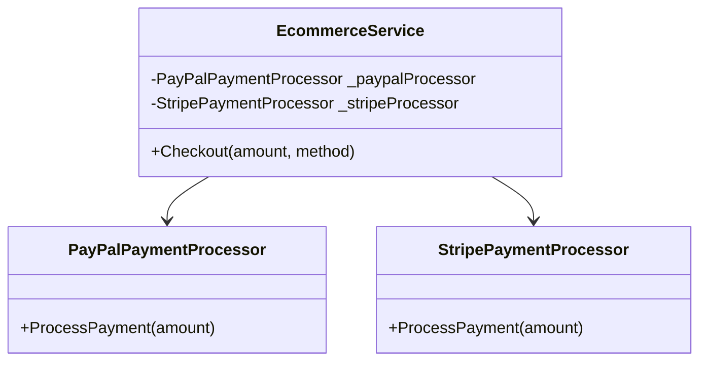
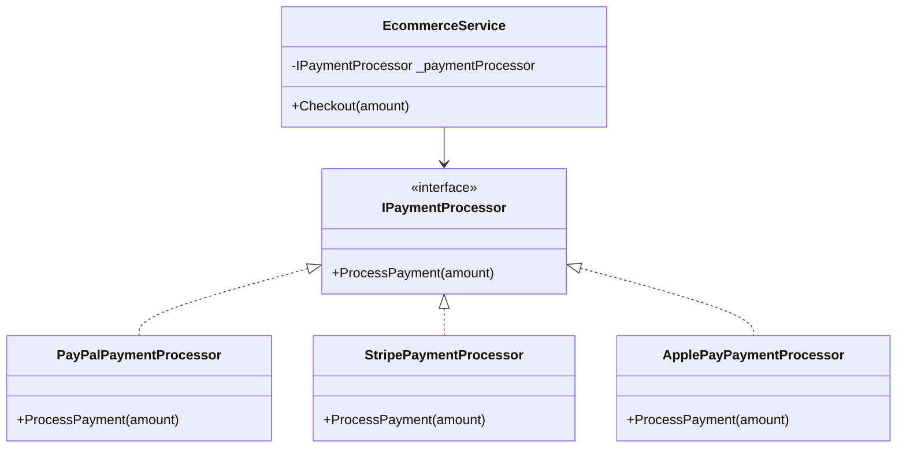

# Dependency Inversion Principle (DIP)

High-level modules should not depend on low-level modules. Both should depend on abstractions.

---

## Concepts You Should Know

### Coupling

Coupling measures how dependent two modules/classes are on each other.

- **Loose Coupling:**  
  Modules know as little as possible about each other’s internal details.  
  They interact through interfaces, abstractions, or events.  
  Changes in one module have minimal impact on others.

- **Tight Coupling:**  
  One module directly depends on the concrete implementation of another.  
  Changes in one module force changes in others.

### Cohesion

Cohesion measures how closely related the responsibilities of a single module/class are.

- **High Cohesion:**  
  A class/module does one well-defined thing (it is also related to SRP mentioned before).  
  Example:  
  - A `UserRepository` class only handles user database operations (no email sending and no order processing).

- **Low Cohesion:**  
  A class/module does many unrelated things, making it hard to maintain and test.

---

## Dependency Inversion & Dependency Injection

Our concept is called Dependency Inversion, but it is done with Dependency Injection.  
You inject your interface or abstract and use this injected object to call any method you want.

- **Dependency Injection (DI):**  
  A technique (often used to implement DIP).  
  It is the way we provide the dependency (the interface implementation) to the class.  
  Most commonly, we use **constructor injection**.

---

## Example: Before DIP (Violation)

We’ll simulate a payment processing system where initially the code is tightly coupled (DIP violation).

### The Problem – DIP Violation

We have an `EcommerceService` that directly depends on concrete payment providers like `PayPalPaymentProcessor` and `StripePaymentProcessor`.  
This means if we want to add any other method or even a small change in the payment API, we must edit `EcommerceService` — because of high coupling.

#### Class Diagram: Before DIP (Violation)



```csharp
public class PayPalPaymentProcessor
{
    public void ProcessPayment(decimal amount)
    {
        Console.WriteLine($"Processing {amount} via PayPal.");
    }
}

public class StripePaymentProcessor
{
    public void ProcessPayment(decimal amount)
    {
        Console.WriteLine($"Processing {amount} via Stripe.");
    }
}

public class EcommerceService
{
    private PayPalPaymentProcessor _paypalProcessor;
    private StripePaymentProcessor _stripeProcessor;

    public EcommerceService()
    {
        _paypalProcessor = new PayPalPaymentProcessor();
        _stripeProcessor = new StripePaymentProcessor();
    }

    public void Checkout(decimal amount, string method)
    {
        if (method == "paypal")
            _paypalProcessor.ProcessPayment(amount);
        else if (method == "stripe")
            _stripeProcessor.ProcessPayment(amount);
    }
}
```

**Problems without DI:**
- `EcommerceService` knows about every payment processor (**tight coupling**).
- **OCP violation:** Adding any new payment method requires modifying `EcommerceService`.
- **Hard to test:** Can’t mock payment services easily.
- **Not reusable** in different contexts.

---

## Solution: Applying DIP

### The Solution – Applying Dependency Inversion Principle

1. Create an abstraction (`IPaymentProcessor`) for high-level module to depend on.
2. Make all payment processors implement this abstraction.
3. Inject the processor into `EcommerceService` via Dependency Injection.

Now `EcommerceService` depends on **abstractions, not concretions**.

#### Class Diagram: After DIP (Solution)



```csharp
// Abstraction
public interface IPaymentProcessor
{
    void ProcessPayment(decimal amount);
}

// Implementations
public class PayPalPaymentProcessor : IPaymentProcessor
{
    public void ProcessPayment(decimal amount)
    {
        Console.WriteLine($"Processing {amount} via PayPal.");
    }
}

public class StripePaymentProcessor : IPaymentProcessor
{
    public void ProcessPayment(decimal amount)
    {
        Console.WriteLine($"Processing {amount} via Stripe.");
    }
}

public class ApplePayPaymentProcessor : IPaymentProcessor
{
    public void ProcessPayment(decimal amount)
    {
        Console.WriteLine($"Processing {amount} via Apple Pay.");
    }
}

// High-level module
public class EcommerceService
{
    private readonly IPaymentProcessor _paymentProcessor;

    // Constructor Injection
    public EcommerceService(IPaymentProcessor paymentProcessor)
    {
        _paymentProcessor = paymentProcessor;
    }

    public void Checkout(decimal amount)
    {
        _paymentProcessor.ProcessPayment(amount);
    }
}

// Composition root
class Program
{
    static void Main()
    {
        // Choose which payment processor to use (could come from config/DI container)
        IPaymentProcessor paymentProcessor = new ApplePayPaymentProcessor();

        EcommerceService ecommerceService = new EcommerceService(paymentProcessor);
        ecommerceService.Checkout(250.00m);
    }
}
```

**Benefits of DIP:**
- Add another payment method without touching `EcommerceService`; just create another class that implements `IPaymentProcessor`.
- High-level modules (business logic) depend on abstractions, not implementations.
- Code is easier to test, maintain, and extend.
- Promotes loose coupling and high cohesion.

---
