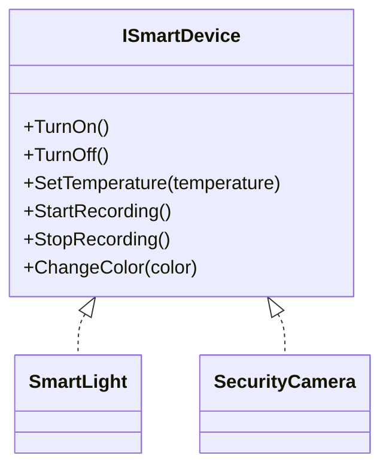
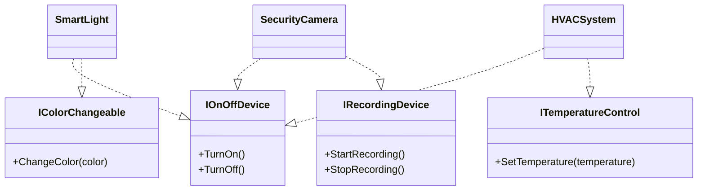

# Interface Segregation Principle (ISP)

Clients should not be forced to depend on methods they do not use.

- Avoid fat interfaces.
- Clients must not implement unnecessary methods.

Instead of making your interface fat and containing many methods that are not common to your subclasses, you should segregate this fat class and divide it into small and relevant interfaces.

---

## ISP Violation Example

Here is a bad example with ISP violation.

### Class Diagram: Before ISP (Violation)



```csharp
public interface ISmartDevice
{
    void TurnOn();
    void TurnOff();
    void SetTemperature(int temperature); // Only HVAC needs this
    void StartRecording(); // Only Cameras need this
    void StopRecording();
    void ChangeColor(string color); // Only Lights need this
}

// Smart Light - forced to implement unrelated methods
public class SmartLight : ISmartDevice
{
    public void TurnOn() => Console.WriteLine("Light turned on");
    public void TurnOff() => Console.WriteLine("Light turned off");

    // Not applicable, but must implement
    public void SetTemperature(int temperature)
    {
        throw new NotImplementedException("Lights don't have temperature control");
    }

    public void StartRecording()
    {
        throw new NotImplementedException("Lights can't record");
    }

    public void StopRecording()
    {
        throw new NotImplementedException("Lights can't record");
    }

    public void ChangeColor(string color)
    {
        Console.WriteLine($"Light color changed to {color}");
    }
}

// Security Camera - also forced to implement unrelated stuff
public class SecurityCamera : ISmartDevice
{
    public void TurnOn() => Console.WriteLine("Camera turned on");
    public void TurnOff() => Console.WriteLine("Camera turned off");

    public void SetTemperature(int temperature)
    {
        throw new NotImplementedException("Cameras don't control temperature");
    }

    public void StartRecording() => Console.WriteLine("Camera recording started");
    public void StopRecording() => Console.WriteLine("Camera recording stopped");

    public void ChangeColor(string color)
    {
        throw new NotImplementedException("Cameras can't change color");
    }
} 
```

Here you can see a big violation here:  
The fat interface forced SmartLight and SecurityCamera to implement unrelated methods.

---

## Solution: Applying ISP

We should solve this violation with ISP.  
First, we should make this fat interface minimal and focused as shown below.

### Class Diagram: After ISP (Solution)



```csharp
public interface IOnOffDevice
{
    void TurnOn();
    void TurnOff();
}

public interface ITemperatureControl
{
    void SetTemperature(int temperature);
}

public interface IRecordingDevice
{
    void StartRecording();
    void StopRecording();
}

public interface IColorChangeable
{
    void ChangeColor(string color);
}
```

Now each class will implement only its related needs as shown below:

```csharp  
public class SmartLight : IOnOffDevice, IColorChangeable
{
    public void TurnOn() => Console.WriteLine("Light turned on");
    public void TurnOff() => Console.WriteLine("Light turned off");
    public void ChangeColor(string color) => Console.WriteLine($"Light color changed to {color}");
}

public class SecurityCamera : IOnOffDevice, IRecordingDevice
{
    public void TurnOn() => Console.WriteLine("Camera turned on");
    public void TurnOff() => Console.WriteLine("Camera turned off");
    public void StartRecording() => Console.WriteLine("Camera recording started");
    public void StopRecording() => Console.WriteLine("Camera recording stopped");
}

public class HVACSystem : IOnOffDevice, ITemperatureControl
{
    public void TurnOn() => Console.WriteLine("HVAC system turned on");
    public void TurnOff() => Console.WriteLine("HVAC system turned off");
    public void SetTemperature(int temperature) => Console.WriteLine($"Temperature set to {temperature}°C");
}
```

As shown above:  
- SmartLight only needs IOnOffDevice, IColorChangeable functions.
- SecurityCamera only needs IOnOffDevice, IRecordingDevice.
- HVACSystem only needs IOnOffDevice, ITemperatureControl.

---
